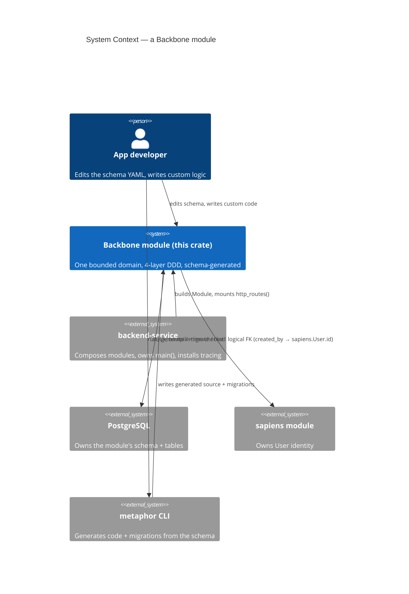
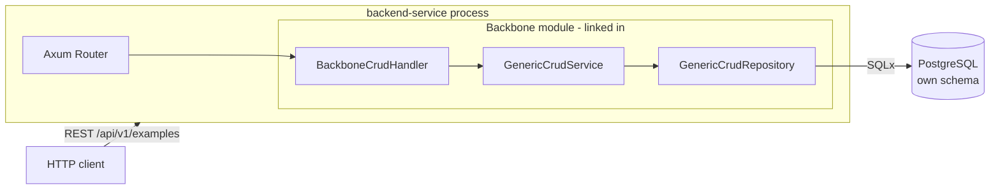
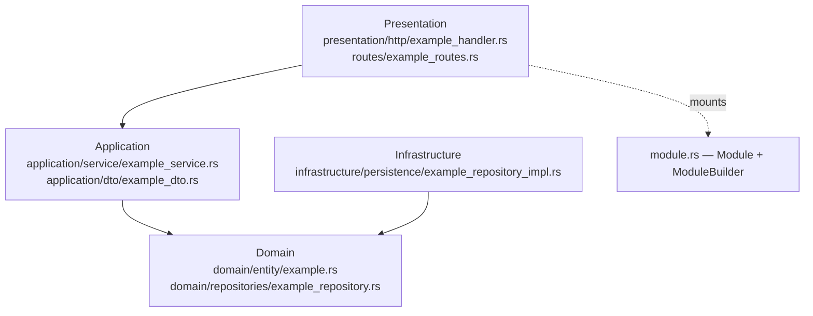
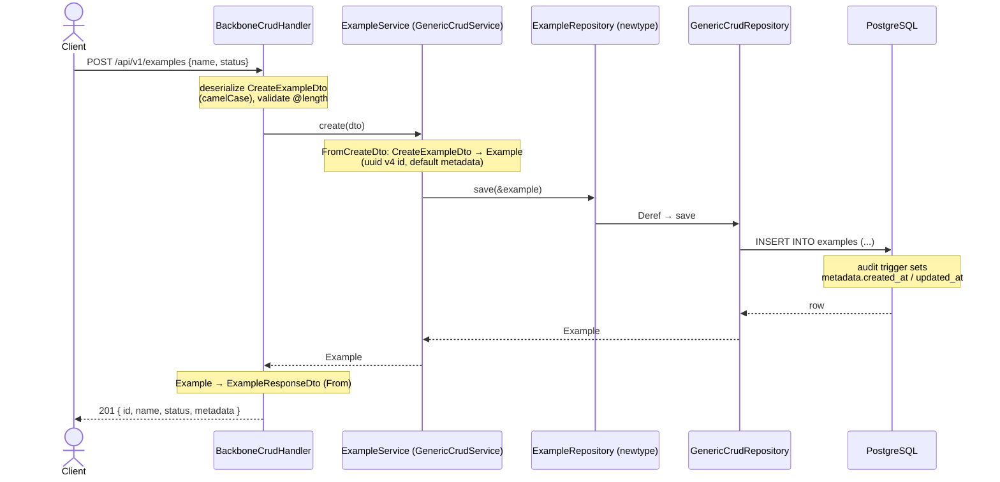

<!-- Reader: Maintainer · Mode: Explanation -->
# Architecture

A Backbone module is a **library crate** that owns one bounded domain as four DDD layers. It does
not run on its own — a `backend-service` composes it, hands it a database pool, and mounts its
router. Everything in `src/` is either generated from the schema YAML or lives inside a regen-safe
custom region. This page shows the system top-down (C4), then traces one request through all four
layers.

## 1. Context

Who uses the module, and what it depends on.

*What to notice: the module is a **dependency**, never an entrypoint. The `metaphor` CLI writes
into it; a service consumes it; identity comes from a **sibling module by logical reference**, not
a copied-in table.*

## 2. Containers

The runnable/deployable pieces and how they talk. The module compiles into the service binary;
there is no separate module process.

*What to notice: the module contributes a `Router` that the service **merges** — the same object
Axum uses everywhere. Nothing about the module is a special runtime; it is ordinary linked-in Rust.*

## 3. Components / modules — the DDD 4-layer shape

Dependencies point **inward only**. Domain depends on nothing.

| Layer | Directory | Holds (in the skeleton) | May depend on |
|-------|-----------|-------------------------|---------------|
| **Domain** | `src/domain/` | `Example` entity (+ `ExampleId`, builder, `apply_patch`, audit accessors), `ExampleStatus` enum, the `ExampleRepository` **trait** (port), `ExampleFilter` | nothing |
| **Application** | `src/application/` | `ExampleService` (type alias over `GenericCrudService`), the Create/Update/Patch/Response/Summary/List DTOs and their conversions, `ServiceError`/`ServiceResult` (re-exported from `backbone-core`) | domain |
| **Infrastructure** | `src/infrastructure/` | `ExampleRepository` newtype over `GenericCrudRepository<Example, SoftDelete>`, `impl_crud_repository!` | domain, application |
| **Presentation** | `src/presentation/`, `src/routes/` | `create_example_routes()` wiring `BackboneCrudHandler`, `ExampleError` → HTTP mapping | application |
| **Composition** | `src/module.rs`, `src/lib.rs` | `Module` / `ModuleBuilder`, public re-exports | all layers (it is the root) |

A subtlety worth internalizing: there are **two `ExampleRepository`s**. The domain layer defines a
`trait ExampleRepository` (the *port* — 20+ async methods). The infrastructure layer defines a
`struct ExampleRepository` (the *adapter* — a newtype that `Deref`s to `GenericCrudRepository`).
The port is the contract; the adapter is the Postgres implementation.

## 4. Data & control flow — `POST /api/v1/examples` end to end

Trace one create request, top to bottom and back.

*What to notice:* four layers, but **only the schema-declared shapes cross them** — `CreateExampleDto`
in, `Example` through the middle, `ExampleResponseDto` out. Every conversion (`From<CreateExampleDto>
for Example`, `From<Example> for ExampleResponseDto`) is generated. The `created_at`/`updated_at`
stamps are set by a **Postgres trigger** ([`002_create_example_table.up.sql`](../../migrations/002_create_example_table.up.sql)),
not by Rust — so audit timestamps hold even for writes that bypass the service.

### The twelve endpoints, for free

`create_example_routes()` calls `BackboneCrudHandler::routes(service, "/examples")`. That single
call wires **all twelve** endpoints; you write none of them:

`list` · `create` · `get` · `update` · `patch` · `soft_delete` · `restore` · `empty_trash` ·
`bulk_create` · `upsert` · `find_by_id` · `list_deleted`

`routes/example_routes.rs` nests them under `/api/v1`, so the create endpoint above is
`POST /api/v1/examples`.

## Where persistence semantics come from

- **Soft delete** is structural: `config.soft_delete: true` in [`index.model.yaml`](../../schema/models/index.model.yaml)
  → `GenericCrudRepository<Example, SoftDelete>` → `soft_delete`/`restore`/`empty_trash`/`list_deleted`
  operate on `metadata.deleted_at`, and a partial index on `(metadata->>'deleted_at')` keeps the
  live-row query fast.
- **Audit** (`config.audit: true`) → the `metadata` JSONB column carrying `created_at`, `updated_at`,
  `deleted_at`, `created_by`, `updated_by`, `deleted_by`. Timestamps are trigger-managed; the `*_by`
  actor fields are logical FKs to `sapiens.User.id`.
- **Own schema per module** → migrations emit `CREATE SCHEMA <module>` and qualify tables as
  `<module>.<table>`, so two modules never collide on a table name.

## Key decisions

- [ADR-0001](adr/adr-0001-schema-yaml-ssot.md) — schema YAML is the single source of truth.
- [ADR-0002](adr/adr-0002-generic-crud.md) — services/repositories are generic, inherited not written.
- [ADR-0003](adr/adr-0003-custom-markers.md) — regen-safety via CUSTOM markers and `user_owned`.

---

Next: [Maintainer Guide](05-maintainer-guide.md) — how to add a feature without breaking the machine.
